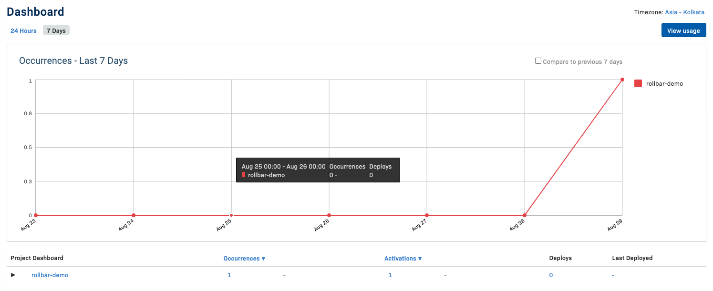

# README

1. Add `rollbar` to `Gemfile`

    ```ruby
    gem 'rollbar'
    ```

2. Run bundle

    ```bash
    bundle install
    ```

3. Install `rollbar`

    ```bash
    rails generate rollbar
    ```

4. Add the `access_token` to the credentials

    ```bash
    EDITOR=vim rails credentials:edit
    ```

    and

    ```yml
    # aws:
    #   access_key_id: 123
    #   secret_access_key: 345

    rollbar:
      acess_token: your_rollbar_access_token
    ```

5. Modify rollbar config to use the access token from credentials

    ```ruby
    # config/initializers/rollbar.rb
    Rollbar.configure do |config|
      # ...
      config.access_token = Rails.application.credentials.dig(:rollbar, :acess_token)
      # ...
    end
    ```

6. Done! Verify using the rake task

    ```bash
    $ rake rollbar:test

    # Test sending to Rollbar...
    # Testing rollbar with "rake rollbar:test". If you can see this, it works.
    ```

    
